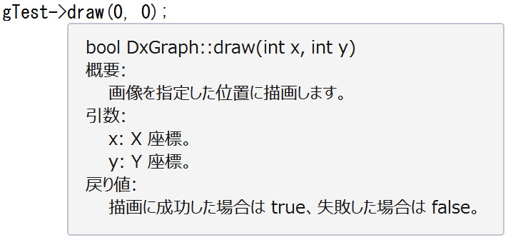

# 実用例: DXライブラリの画像管理
クラスの使い方の一例を紹介。「クラスについてはまあまあ理解できたけど具体的な使い方がわからん」っていう人が多分いると思うので。

今回は [DXライブラリ](http://homepage2.nifty.com/natupaji/DxLib/) での画像表示を題材にしてみるよ。

## (おさらい)DXライブラリで画像を表示するには
1. `LoadGraph()`関数を使ってメモリ上に画像データを読み込む。画像のIDとして「グラフィックハンドル」が返ってくる
2. グラフィックハンドルを使用して`DrawGraph()`関数で画像を画面に描画
3. (任意)`DeleteGraph()`関数を使ってメモリを解放する。

だったはず。

これをクラスを使って考えてみよう。

## クラスの設計
- コンストラクタで画像の読み込みを行う
- デストラクタでメモリの解放を行う
- グラフィックハンドルはクラス内部で保持(private)
- 画像の描画をする関数を作る

この方針でクラスを実際に作ってみましょう。

## クラスを作る

```cpp
//
// DxGraph.h
//

#include <string>
#pragma once

// DX ライブラリの画像を表します。
class DxGraph
{
private:
	// グラフィックハンドル
	std::shared_ptr<int> handle;

public:
	// 概要:
	//     DxGraph オブジェクトを初期化します。
	// 引数:
	//     fileName: 読み込む画像ファイル名。
	// 例外:
	//     ファイルを読み込めなかった時に例外が発生します。
	DxGraph(std::string fileName);

	// 概要:
	//     メモリから画像を削除します。
	~DxGraph();

	// 概要:
	//     画像を指定した位置に描画します。
	// 引数:
	//     x: X 座標。
	//     y: Y 座標。
	// 戻り値:
	//     描画に成功した場合は true、失敗した場合は false。
	bool draw(int x, int y);
};
```

```cpp
//
// DxGraph.cpp
//

#include "DxGraph.h"
#include <DxLib.h>

DxGraph::DxGraph(std::string fileName)
{
	// LoadGraph() 関数で画像を読み込む
	handle.reset(new int(LoadGraph(fileName.c_str())), [](int *h) { DeleteGraph(*h); });
	if (*handle == -1)
		throw "LoadGraph: 画像読み込みエラー";
}

DxGraph::~DxGraph()
{

}

bool DxGraph::draw(int x, int y)
{
	// DrawGraph() 関数で描画
	int result = DrawGraph(x, y, *handle, true);
	return result != -1;
}
```

ヘッダファイルにコメントめっちゃ書いてある。それのメリットについては後述。

## クラスを使う

```cpp
//
// main.cpp
//

#include <DxLib.h>
#include "DxGraph.h"

int WINAPI WinMain(HINSTANCE hInst, HINSTANCE hPrevInst, LPSTR cmdLine, int cmdShow)
{
	// DXライブラリ初期化
	if (DxLib_Init() == -1) return -1;

	DxGraph gTest("test.png");
	
	// (0, 0) の位置に描画
	gTest.draw(0, 0);

	WaitKey();

	// DXライブラリ終了処理
	DxLib_End();
	return 0;
}
```

## クラス正直めんどくない？？？
確かにクラスを定義するところは面倒臭いかもしれない。

しかし、クラスを使う側としては、それを上回るだけのメリットがある。

今回、画像関係の処理をすべてクラスにまとめた。画像の読み込み・表示・解放を、クラスのコンストラクタ・メンバ関数・デストラクタに関連付けた。そうすることで、「それぞれバラバラに定義された関数を呼ぶスタイル」から、「オブジェクトに関連付けられた関数を呼ぶスタイル」になる。

後者のスタイルの最大のメリットは、具体的に言えば、  
**「ヘッダファイルを見れば使い方がすぐに分かる」**  
ことである。関連している処理だけがクラス内にリストアップされているから、関係ない処理はそのクラス内には書いていない。よって、目的の関数を探すのがメチャクチャ楽になる。

Visual Studio を使用していればこのメリットがさらに大きくなる。

上記の`main.cpp`を打ち込んでいる途中で、

```cpp
gTest->
```

ここまで打ち込んだら、勝手にメンバ一覧が補完リストに出てきたと思う。名前がうろ覚えでもすぐに目的の関数を選択できるからコーディングのスピードが上がる上がる。

さらに、関数名にカーソルを合わせると、ヘッダファイルに書いたコメントがポップアップ表示される。



やったぜ。相当楽にコーディングできること間違いなし。

[目次へ](../../README.md)
